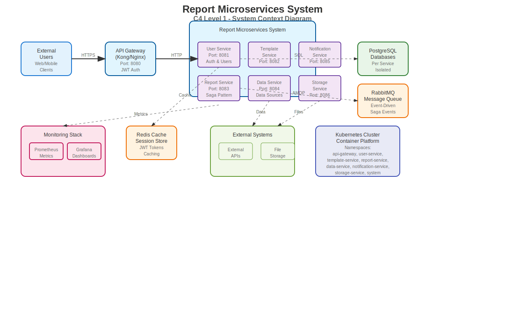
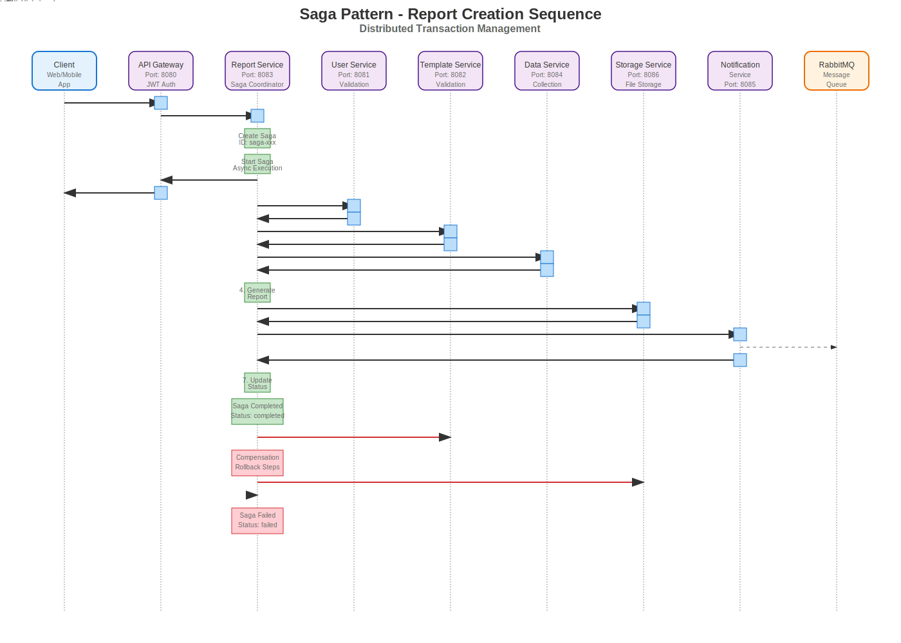

# 📊 Report Microservices System

Система микросервисов для создания и управления отчетами с использованием Saga паттерна для распределенных транзакций.

## 🏗️ Архитектура

Система построена на микросервисной архитектуре с использованием:
- **API Gateway** для единой точки входа
- **Saga Pattern** для управления распределенными транзакциями
- **Event-Driven Architecture** с RabbitMQ
- **Kubernetes** для оркестрации контейнеров
- **Comprehensive Monitoring** с Prometheus и Grafana

### C4 Диаграмма


### Sequence Диаграмма Saga


## 🚀 Быстрый старт

### Развертывание

1. **Клонирование репозитория**
```bash
git clone <repository-url>
cd exam
```

2. **Развертывание всех сервисов**
```bash
./scripts/deploy.sh
```

3. **Проверка статуса**
```bash
kubectl get pods -A
```

4. **Настройка port-forward для доступа**
```bash
# API Gateway
kubectl port-forward service/api-gateway-service 8080:80 -n api-gateway &

# Grafana
kubectl port-forward service/grafana-service 3000:80 -n system &

# Prometheus
kubectl port-forward service/prometheus-service 9090:80 -n system &
```

## 🏢 Микросервисы

### 1. API Gateway http://arch.homework
- **Назначение**: Единая точка входа для всех клиентов

**Endpoints:**
```
POST /api/v1/users/register    # Регистрация пользователя
POST /api/v1/users/login       # Авторизация
GET  /api/v1/users/profile     # Профиль пользователя
```

### 2. User Service (Port: 8081)
- **Назначение**: Управление пользователями и аутентификация
- **Функции**:
  - Регистрация и авторизация пользователей
  - Валидация пользователей в Saga
  - Управление профилями

**Endpoints:**
```
POST /api/v1/users/register
POST /api/v1/users/login
GET  /api/v1/users/profile
PUT  /api/v1/users/profile
```

### 3. Template Service (Port: 8082)
- **Назначение**: Управление шаблонами отчетов
- **Функции**:
  - Создание и редактирование шаблонов
  - Валидация шаблонов в Saga
  - Управление переменными шаблонов

**Endpoints:**
```
POST   /api/v1/templates
GET    /api/v1/templates
GET    /api/v1/templates/:id
PUT    /api/v1/templates/:id
DELETE /api/v1/templates/:id
```

### 4. Report Service (Port: 8083)
- **Назначение**: Создание отчетов через Saga паттерн
- **Функции**:
  - Saga Coordinator для распределенных транзакций
  - Создание и управление отчетами
  - CSV экспорт отчетов
  - Мониторинг статуса Saga

**Endpoints:**
```
POST /api/v1/sagas/reports           # Создание отчета через Saga
GET  /api/v1/sagas/:id               # Статус Saga
GET  /api/v1/sagas/:id/progress      # Прогресс Saga
POST /api/v1/sagas/:id/retry         # Повтор Saga
GET  /api/v1/reports                 # Список отчетов
GET  /api/v1/reports/:id             # Детали отчета
GET  /api/v1/reports/:id/export/csv  # Экспорт в CSV
```

### 5. Data Service (Port: 8084)
- **Назначение**: Сбор данных из внешних источников
- **Функции**:
  - Подключение к внешним API
  - Сбор данных для отчетов
  - Управление источниками данных

**Endpoints:**
```
POST /api/v1/data-sources
GET  /api/v1/data-sources
POST /api/v1/data/collect
```

### 6. Storage Service (Port: 8086)
- **Назначение**: Управление файлами и хранилищем
- **Функции**:
  - Загрузка и скачивание файлов
  - Управление метаданными файлов
  - Хранение сгенерированных отчетов

**Endpoints:**
```
POST /api/v1/storage/upload
GET  /api/v1/storage/files/:id
GET  /api/v1/storage/files
```

### 7. Notification Service (Port: 8085)
- **Назначение**: Отправка уведомлений пользователям
- **Функции**:
  - Обработка событий из RabbitMQ
  - Отправка уведомлений о готовности отчетов
  - Управление шаблонами уведомлений

**Endpoints:**
```
POST /api/v1/notifications/send
GET  /api/v1/notifications
GET  /api/v1/notifications/templates
```

## 🔄 Saga Pattern

Система использует Saga паттерн для управления распределенными транзакциями при создании отчетов.

### Шаги Saga:

1. **Validate User** - Валидация пользователя
2. **Validate Template** - Валидация шаблона
3. **Collect Data** - Сбор данных
4. **Generate Report** - Генерация отчета
5. **Store File** - Сохранение файла
6. **Send Notification** - Отправка уведомления
7. **Update Status** - Обновление статуса

### Компенсационные действия:
- При ошибке выполняется откат выполненных шагов
- Каждый шаг имеет соответствующую компенсационную операцию
- Система обеспечивает консистентность данных

## 📊 Мониторинг

### Prometheus
- Сбор метрик с всех микросервисов
- HTTP метрики, бизнес-метрики, метрики БД
- Доступ: `http://localhost:9090`

### Grafana
- Дашборды для визуализации метрик
- Мониторинг производительности
- Алерты и уведомления
- Доступ: `http://localhost:3000` (admin/admin123)

### Дашборды:
- **Microservices Overview** - Общий обзор системы
- **Business Metrics** - Бизнес-метрики
- **Saga Metrics** - Метрики Saga транзакций
- **Service Details** - Детальный мониторинг сервисов
- **Alerts & Health** - Алерты и состояние здоровья

## 🛠️ Разработка

## 🧪 Тестирование

### Postman коллекция
Используйте `postman/Report_Microservices_Complete.postman_collection.json` для тестирования API.

### Скрипты тестирования

```bash
# Быстрое тестирование
./scripts/metrics.sh

# Полная проверка системы
./scripts/monitoring.sh

# Создание дашбордов
./scripts/monitoring.sh dashboards

# Генерация метрик новых функций
./scripts/monitoring.sh new-features
```

### Примеры использования

1. **Создание отчета через Saga**
```bash
# 1. Регистрация пользователя
curl -X POST http://arch.homework/api/v1/users/register \
  -H "Content-Type: application/json" \
  -d '{"name":"testuser","email":"test@example.com","password":"password123"}'

# 2. Авторизация
curl -X POST http://arch.homework/api/v1/users/login \
  -H "Content-Type: application/json" \
  -d '{"email":"test@example.com","password":"password123"}'

# 3. Создание отчета через Saga
curl -X POST http://arch.homework/api/v1/sagas/reports \
  -H "Authorization: Bearer <token>" \
  -H "Content-Type: application/json" \
  -d '{"template_id":"1","name":"Test Report","parameters":{"title":"Test"}}'

# 4. Проверка статуса Saga
curl -H "Authorization: Bearer <token>" \
  http://arch.homework/api/v1/sagas/<saga_id>

# 5. Экспорт отчета в CSV
curl -H "Authorization: Bearer <token>" \
  http://arch.homework/api/v1/reports/<report_id>/export/csv
```

### Kubernetes конфигурация

Все сервисы развернуты в отдельных namespace:
- `api-gateway`
- `user-service`
- `template-service`
- `report-service`
- `data-service`
- `notification-service`
- `storage-service`
- `system` (для инфраструктуры)

## 📈 Метрики

Система собирает следующие метрики:

### HTTP метрики
- `http_requests_total` - Общее количество HTTP запросов
- `http_request_duration_seconds` - Время выполнения запросов
- `http_requests_by_status_code` - Запросы по кодам статуса

### Бизнес-метрики
- `business_operations_total` - Бизнес-операции
- `business_operation_duration_seconds` - Время выполнения операций
- `saga_started_total` - Запущенные Saga
- `saga_completed_total` - Завершенные Saga
- `saga_failed_total` - Неудачные Saga

### Метрики БД
- `database_query_duration_seconds` - Время выполнения запросов
- `database_connections_active` - Активные соединения